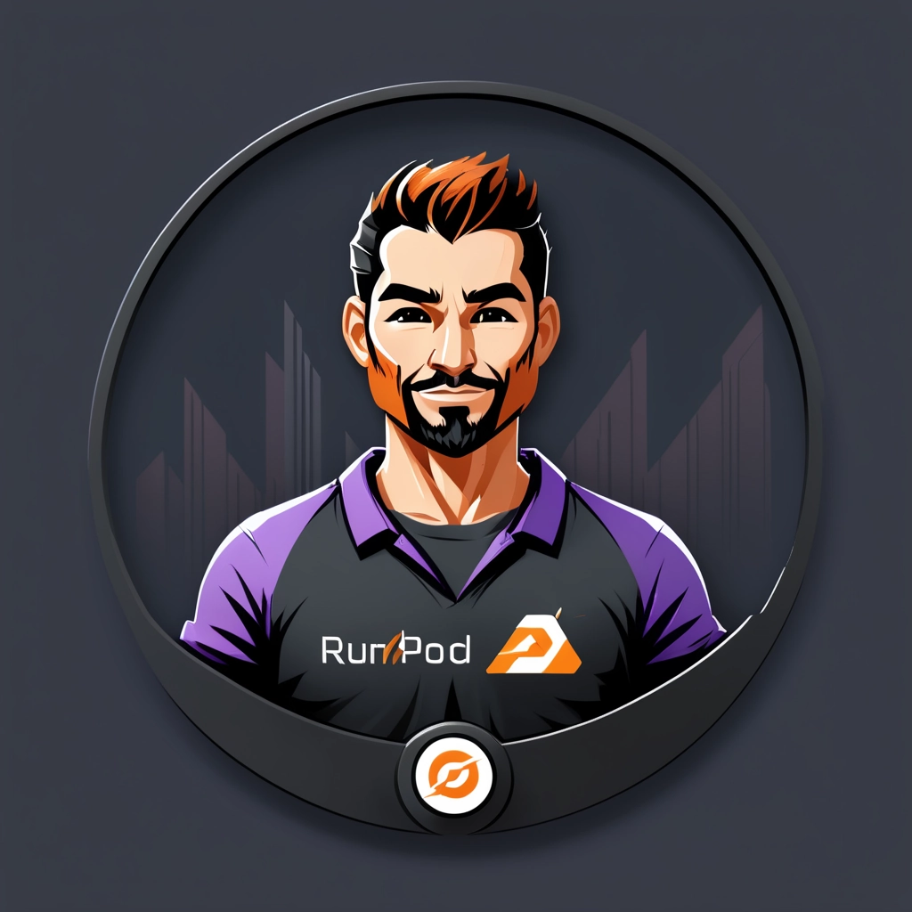

# runpod-serverless-comfyui-worker
A somewhat optimized, serverless [ComfyUI](https://github.com/comfyanonymous/ComfyUI) worker for [RunPod](https://www.runpod.io/), highly specific to my own personal use case, which just happens to require a lot of customization and flexibility! :heart:

## Features 
* Launch [ComfyUI](https://github.com/comfyanonymous/ComfyUI) workflows on demand in seconds
* Automatically upload generations to Amazon AWS *(requires [ENV Variables](/readme/aws-setup.md))
* Get base64 data for generated images as job output *(when not aws upload && tobase64 flag set)
* Image based on [Ubuntu + NVIDIA CUDA](https://hub.docker.com/r/nvidia/cuda)
* Easily add custom models/loras/nodes/etc via a selection of methods
* Sends progress updates so you can track/display them in your own ui
* Support for runpod network volume mounted models/nodes
* Allows for batch image processing && bulk AWS uploads
* Job output also returns non image/video node outputs 

## Default models/nodes for dekita/runpod-serverless-comfyui-worker:latest
* model: [sd_xl_base_1.0.safetensors](https://huggingface.co/stabilityai/stable-diffusion-xl-base-1.0)
* model: [sdxl_vae.safetensors](https://huggingface.co/stabilityai/sdxl-vae/)
* nodes: [efficiency-nodes-comfyui](https://github.com/LucianoCirino/efficiency-nodes-comfyui)
* nodes: [comfyui-wd14-tagger](https://github.com/pythongosssss/ComfyUI-WD14-Tagger)

## Runpod.io Quickstart 
* 🐳 Use the latest image for your worker: [dekita/runpod-serverless-comfyui-worker:latest](https://hub.docker.com/r/dekita/runpod-serverless-comfyui-worker)
* ⚙️ [Setup environment variables for AWS](/readme/aws-setup.md)
* ℹ️ [Use the Docker image on RunPod](/readme/runpod-setup.md)

## Detailed Guides
* [Interact with your RunPod API](/readme/api-interactions.md) 
* [Get the workflow from ComfyUI](/readme/get-workflow.md) 
* [Setup Amazon AWS S3 Bucket](/readme/aws-setup.md) (optional)
* [Building Customized Image](/readme/custom-image.md) (optional)
* [Github Actions: Auto Deploy to Docker Hub](/readme/auto-deploy.md) (optional)

## Additional Acknowledgements
* [comfyanonymous](https://github.com/comfyanonymous) creator of [ComfyUI](https://github.com/comfyanonymous/ComfyUI).
* [Tim Pietrusky](https://github.com/TimPietrusky), creator of [runpod-worker-comfy](https://github.com/blib-la/runpod-worker-comfy). Without that project to help me understand the process, this one would not exist! :heart: 
